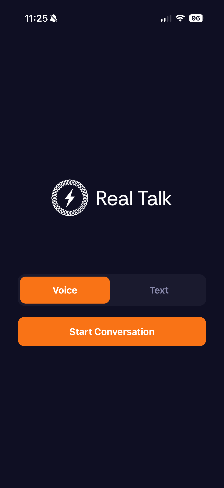
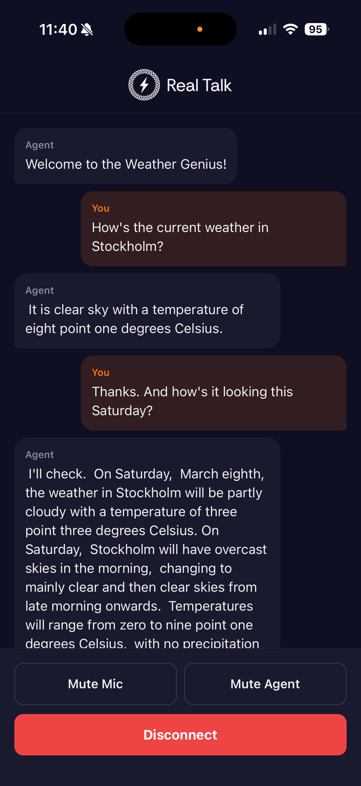

<a href="https://realtalk.ml/home"></a>

# Real Talk SDK

TypeScript SDK's for building voice agents with [Real Talk](https://realtalk.ml/home).

## Packages

### [`@realtalk-ai/react`](./packages/react)

React hooks for web apps. Provides `useConversation` for managing voice and text sessions, with browser-based audio capture via AudioWorklet and Web Audio API playback. Supports echo cancellation, noise suppression, and auto-gain control through browser constraints.

### [`@realtalk-ai/react-native`](./packages/react-native)

React Native hooks for iOS and Android apps. Same `useConversation` API as the React SDK, and it implements hardware-level echo cancellation and noise suppression on both platforms. Includes an Expo config plugin for zero-config setup.

### [`@realtalk-ai/core`](./packages/core)

Framework-agnostic transport layer, types, and utilities. Handles WebSocket connections, reconnection, PCM encoding, and event parsing. Used internally by the React and React Native SDKs, use this directly if you need full control or are building a very custom integration.

## Quick start

```bash
npm install @realtalk-ai/react @realtalk-ai/core
```

```tsx
import { RealTalkProvider, useConversation } from "@realtalk-ai/react";

const App = () => {
  return (
    <RealTalkProvider tokenUrl="https://your-server.com/api/token">
      <Chat />
    </RealTalkProvider>
  );
};

const Chat = () => {
  const { status, messages, startConversation, endConversation } =
    useConversation();

  return (
    <div>
      {messages.map((msg) => (
        <p key={msg.id}>
          {msg.role}: {msg.text}
        </p>
      ))}

      {status === "not_started" || status === "finished" ? (
        <button
          onClick={() =>
            startConversation({ agentId: "your-agent-id", mode: "voice" })
          }
        >
          Start
        </button>
      ) : (
        <button onClick={endConversation}>End</button>
      )}
    </div>
  );
};
```

The React Native SDK uses the same API — just swap the import to `@realtalk-ai/react-native`.

## Examples

### [Expo app](./examples/expo-app)

A simple React Native app built with Expo, showing how to use `@realtalk-ai/react-native` with voice conversations. Expects a running token server to work.

<p>
  
  &nbsp;&nbsp;
  
</p>

### [Token server](./examples/server)

A minimal FastAPI server that creates short-lived session tokens for use in frontend application. Use this as a starting point for your own token endpoint.

## Development

```bash
pnpm install
pnpm build        # build all packages
pnpm dev          # watch mode
pnpm test         # run all tests
```

Run tests for a specific package:

```bash
pnpm --filter @realtalk-ai/core test
pnpm --filter @realtalk-ai/react test
pnpm --filter @realtalk-ai/react-native test
```

## License

MIT
