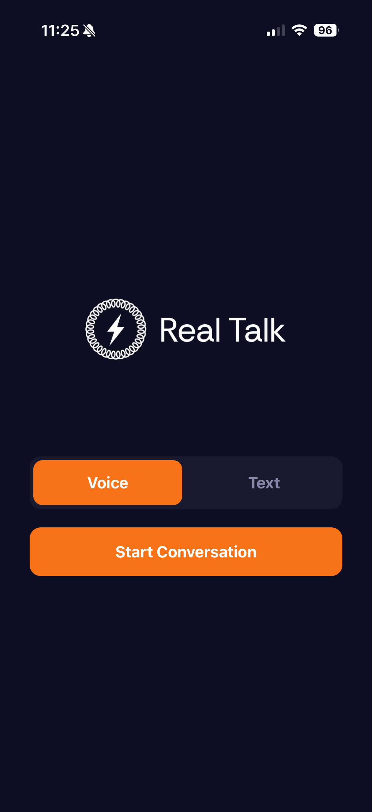
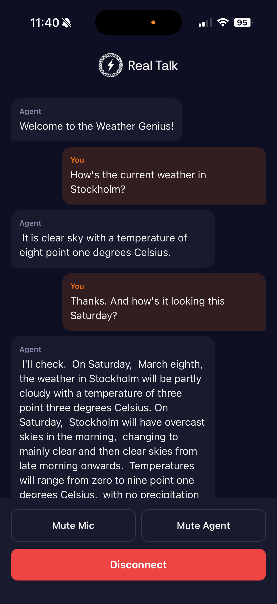

<a href="https://realtalk.ml/home"></a>

# Real Talk SDK

[](https://github.com/realtalk-ai/js-sdk/actions/workflows/ci.yml)
[](https://www.npmjs.com/package/@realtalk-ai/core)
[](https://www.npmjs.com/package/@realtalk-ai/react)
[](https://www.npmjs.com/package/@realtalk-ai/react-native)
[](https://www.npmjs.com/package/@realtalk-ai/embed)

TypeScript SDK's for building voice agents with [Real Talk](https://realtalk.ml/home).

## Packages

### [`@realtalk-ai/react`](./packages/react)

React hooks for web apps. Provides `useConversation` for managing voice and text sessions, with browser-based audio capture via AudioWorklet and Web Audio API playback. Supports echo cancellation, noise suppression, and auto-gain control through browser constraints.

### [`@realtalk-ai/react-native`](./packages/react-native)

React Native hooks for iOS and Android apps. Same `useConversation` API as the React SDK (`enableMic`, `disableMic`, and `startMuted` are React-only for now), and it implements hardware-level echo cancellation and noise suppression on both platforms. Includes an Expo config plugin for zero-config setup.

### [`@realtalk-ai/embed`](./packages/embed)

Embeddable `<realtalk-embed>` web component. Adds your agent to any website as a floating chat widget, with text and voice, from a two-line HTML snippet. The script is a single self-contained file and no backend integration is needed on your site.

### [`@realtalk-ai/core`](./packages/core)

Framework-agnostic transport layer, types, and utilities. Handles WebSocket connections, reconnection, PCM encoding, and event parsing. Used internally by the React and React Native SDKs, use this directly if you need full control or are building a very custom integration.

## Quick start

```bash
npm install @realtalk-ai/react @realtalk-ai/core
```

```tsx
import { RealTalkProvider, useConversation } from "@realtalk-ai/react";

const App = () => {
  return (
    <RealTalkProvider tokenUrl="https://your-server.com/api/token">
      <Chat />
    </RealTalkProvider>
  );
};

const Chat = () => {
  const { status, messages, startConversation, endConversation } =
    useConversation();

  return (
    <div>
      {messages.map((msg) => (
        <p key={msg.id}>
          {msg.role}: {msg.text}
        </p>
      ))}

      {status === "not_started" || status === "finished" ? (
        <button
          onClick={() =>
            startConversation({ agentId: "your-agent-id", mode: "voice" })
          }
        >
          Start
        </button>
      ) : (
        <button onClick={endConversation}>End</button>
      )}
    </div>
  );
};
```

The React Native SDK uses the same API — just swap the import to `@realtalk-ai/react-native`.

## Examples

### [Expo app](./examples/expo-app)

A simple React Native app built with Expo, showing how to use `@realtalk-ai/react-native` with voice conversations. Expects a running token server to work.

<p>
  
  &nbsp;&nbsp;
  
</p>

### [Token server](./examples/server)

A minimal FastAPI server that creates short-lived session tokens for use in frontend application. Use this as a starting point for your own token endpoint.

### [Embed demo](./examples/embed-demo)

A minimal page showing the copy-paste `@realtalk-ai/embed` snippet on a stand-in website. Run it with `pnpm embed-demo`.

## Development

```bash
pnpm install
pnpm build        # build all packages
pnpm dev          # watch mode
pnpm test         # run all tests
```

Run tests for a specific package:

```bash
pnpm --filter @realtalk-ai/core test
pnpm --filter @realtalk-ai/react test
pnpm --filter @realtalk-ai/react-native test
```

## Releasing (for maintainers)

Versioning and publishing are managed with [Changesets](https://github.com/changesets/changesets).

### 1. With each PR that changes a package

```bash
pnpm changeset
```

Select the affected packages, pick a bump level (patch/minor/major), and write a one-line summary. Commit the generated `.changeset/*.md` file together with your changes. Skip this step for changes that don't need a release (docs, CI, tooling). If CI's changeset check still complains about such a change, add an empty changeset with `pnpm changeset --empty`.

### 2. The Version Packages PR

Whenever pending changesets exist on `main`, the Release workflow opens (and keeps updating) a **"Version Packages"** PR from the `changeset-release/main` branch. Its diff is the combined result of all pending changesets: bumped `package.json` versions, updated changelogs, and the consumed changeset files removed. It is a live preview of the next release — more changesets merged to `main` update it automatically, and it can stay open as long as you like.

### 3. Merge it to release

Merging the Version Packages PR is the release. The Release workflow builds all packages in dependency order, publishes every package whose version is not on npm yet, pushes one git tag per published package (e.g. `@realtalk-ai/core@0.3.0`), and creates matching GitHub releases with the changelog entries as notes.

Publishing authenticates with npm via [trusted publishing (OIDC)](https://docs.npmjs.com/trusted-publishers) — no npm token is stored anywhere and no `npm login` is involved.

### One-time setup (already done, documented for reference)

- Each `@realtalk-ai` package on npmjs.com has a trusted publisher configured: GitHub Actions, repository `realtalk-ai/js-sdk`, workflow `release.yml`.
- The repo has a `CHANGESETS_TOKEN` actions secret containing a fine-grained PAT with contents + pull-requests write access. The workflow uses it to open the Version Packages PR, because PRs created with the default `GITHUB_TOKEN` never trigger CI and would be blocked by the required checks.

### Manual release (fallback)

The old local flow still works if CI is unavailable: run `pnpm changeset version` on a branch, merge it via PR, then from an up-to-date `main` checkout run `pnpm release && git push --follow-tags`. This requires `npm login` with publish access to `@realtalk-ai` and prompts for a 2FA code.

## License

MIT
